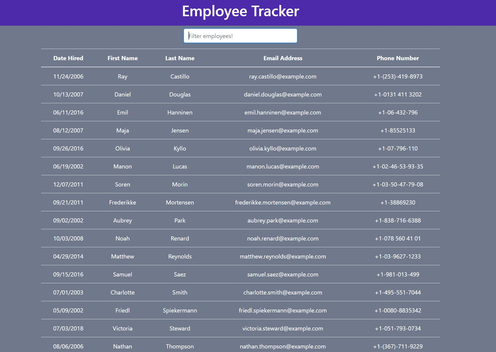

# Employee Directory

## Description
    
I created an Employee Directory React application. The application pulls between 10-20 users using the Random User Generator API. You can then filter and sort users by hire date, first name, last name, email and phone number. 
    
## Table of Contents
1. [Installation](#installation)
2. [Usage](#usage)
3. [License](#license)
4. [Questions](#questions)
5. [Credits](#credits)
    
## Installation
    
[Deployed Application](https://guarded-tor-62033.herokuapp.com/)
    
## Usage

## License
    
MIT License
    
Copyright (c) 2021 Mike Coletta
          
## Questions?
    
[Github](https://github.com/MikeColetta)
    
For any questions, please send me an [email](mailto:coletta.mike@gmail.com).